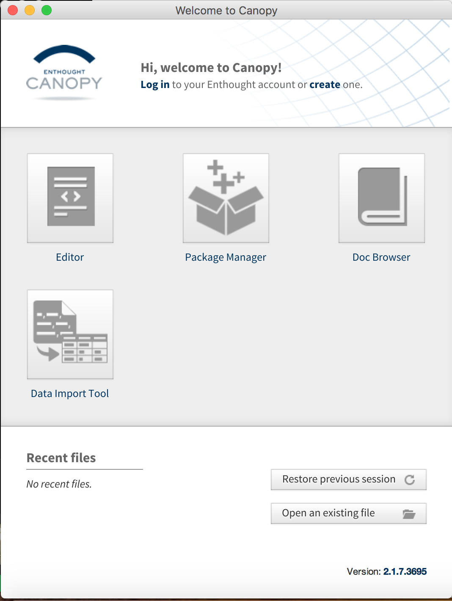
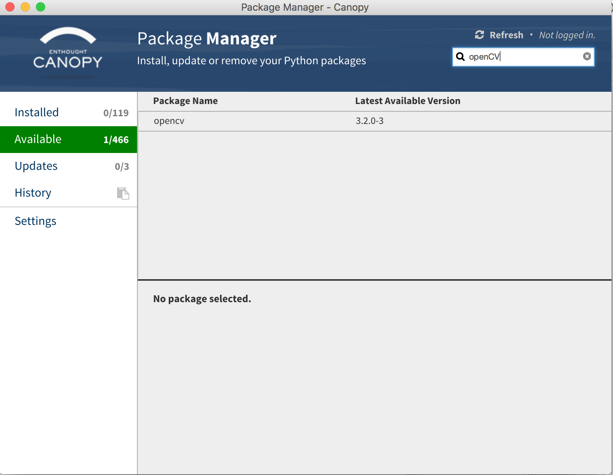
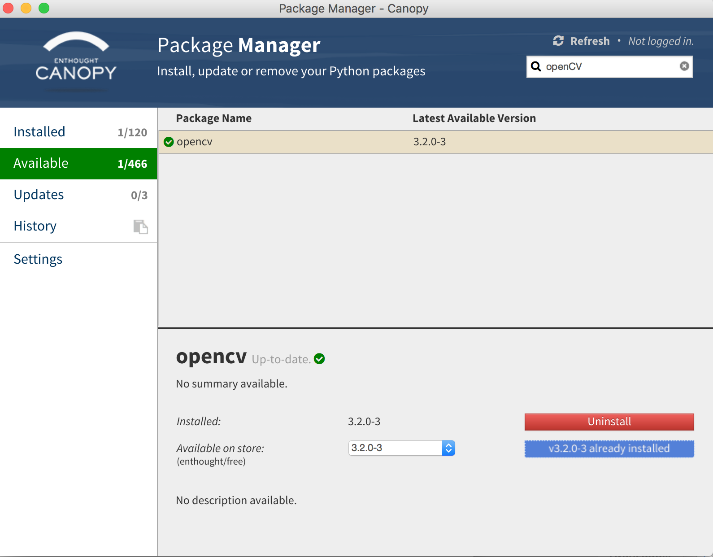

# Instalación de Módulos y Programas Necesarios
Antes de comenzar el curso es necesario que tengas instalado un conjunto de programas y módulos que permiten que todo el sistema corra correctamente. 

## Instala Python 3.4+ :snake:
Primero necesitamos instalar Python. Para esto es necesario que vayas a el sitio de [Python.org](https://www.python.org/) y descargues la versión 3.6 o la más reciente. Cuando estes instalando el programa asegurante de darle click cuando te aparezca la opción de agregar Pythonal PATH de tu computadora ya que de otra manera tendras que hacerlo a mano.

## Instala Enthought Canopy :crystal_ball:

Utilizaremos Canopy, un conjunto de herramientas y módulos de Python que sirven para poder hacer ciencia de datos, machine learning, etc, con el beneficio de que ya vienen preconfigurados y no es necesario ni instalar los módulos básicos ni configurarlos a mano. Otro de los beneficios de Canopy es que instalar módulos que pueden ser complicados de configurar no te tomará mas de un par de clicks. 

### Canopy o Anaconda
Una de las preguntas más frecuentes es sobre cual de los conjuntos de herramientas es mejor. Esto es más una elección personal. Yo elegí Canopy porque no instala una version adicional de Python (anaconda instala una version de Python llamada Anaconda :snake:) y esto representa una gran ventaja porque los modulos de python que instala enthough son accesibles por cualquier programa que utilice Python. 

## Instala OpenCV en Canopy
Una vez que hayas instalado Canopy, será necesario que instales el módulo OpenCV que nos va permitir trabajar con visión computacional. Para esto es necesario que: 
1. Abre Canopy
2. Si es la primera vez que lo abres el programa configurara el ambiente de desarrollo. 
3. Damos click en Package Manager

4. Buscamos la pestaña Available y le damos click
5. En el buscador escribir OpenCV 

6. Instala el modulo
7. :tada: ¡Listo! :tada: 
